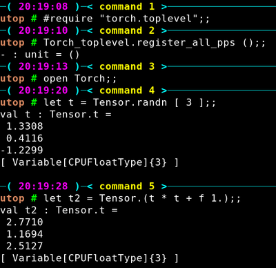

# ocaml-torch
__ocaml-torch__ provides some ocaml bindings for the [PyTorch](https://pytorch.org) tensor library.
This brings to OCaml NumPy-like tensor computations with GPU acceleration and tape-based automatic
differentiation.

[](https://travis-ci.org/LaurentMazare/ocaml-torch)

These bindings use the [PyTorch C++ API](https://pytorch.org/cppdocs/) and are
mostly automatically generated. The current GitHub tip corresponds to PyTorch **v1.1.0**.

## Opam Installation

The [opam](https://opam.ocaml.org/) package can be installed using the following command.
This automatically installs the CPU version of libtorch.

```bash
opam install torch
```

You can then compile some sample code, see some instructions below.
__ocaml-torch__ can also be used in interactive mode via
[utop](https://github.com/ocaml-community/utop) or
[ocaml-jupyter](https://github.com/akabe/ocaml-jupyter).

Here is a sample utop session.




### Build a Simple Example

To build a first torch program, create a file `example.ml` with the
following content.

```ocaml
open Torch

let () =
  let tensor = Tensor.randn [ 4; 2 ] in
  Tensor.print tensor
```

Then create a `dune` file with the following content:

```ocaml
(executables
  (names example)
  (libraries torch))
```

Run `dune exec example.exe` to compile the program and run it!

Alternatively you can first compile the code via `dune build example.exe` then run the executable
`_build/default/example.exe` (note that building the bytecode target `example.bc` may
not work on macos).

## Tutorials

* [MNIST tutorial](https://github.com/LaurentMazare/ocaml-torch/tree/master/examples/mnist).
* [Finetuning a ResNet-18 model](https://github.com/LaurentMazare/ocaml-torch/blob/master/examples/pretrained/).
* [Generative Adversarial Networks](https://github.com/LaurentMazare/ocaml-torch/blob/master/examples/gan).
* [Running some Python model](https://github.com/LaurentMazare/ocaml-torch/tree/master/examples/jit).

## Examples

Below is an example of a linear model trained on the MNIST dataset ([full
code](https://github.com/LaurentMazare/ocaml-torch/blob/master/examples/mnist/linear.ml)).

```ocaml
  (* Create two tensors to store model weights. *)
  let ws = Tensor.zeros [image_dim; label_count] ~requires_grad:true in
  let bs = Tensor.zeros [label_count] ~requires_grad:true in

  let model xs = Tensor.(mm xs ws + bs) in
  for index = 1 to 100 do
    (* Compute the cross-entropy loss. *)
    let loss =
      Tensor.cross_entropy_for_logits (model train_images) ~targets:train_labels
    in

    Tensor.backward loss;

    (* Apply gradient descent, disable gradient tracking for these. *)
    Tensor.(no_grad (fun () ->
        ws -= grad ws * f learning_rate;
        bs -= grad bs * f learning_rate));

    (* Compute the validation error. *)
    let test_accuracy =
      Tensor.(sum (argmax (model test_images) = test_labels) |> float_value)
      |> fun sum -> sum /. test_samples
    in
    printf "%d %f %.2f%%\n%!" index (Tensor.float_value loss) (100. *. test_accuracy);
  end

```

* Some [ResNet examples on CIFAR-10](https://github.com/LaurentMazare/ocaml-torch/tree/master/examples/cifar).
* A simplified version of
  [char-rnn](https://github.com/LaurentMazare/ocaml-torch/blob/master/examples/char_rnn)
  illustrating character level language modeling using Recurrent Neural Networks.
* [Neural Style Transfer](https://github.com/LaurentMazare/ocaml-torch/blob/master/examples/neural_transfer)
  applies the style of an image to the content of another image. This uses some deep Convolutional Neural Network.

## Models and Weights

Various pre-trained computer vision models are implemented in the
[vision library](https://github.com/LaurentMazare/ocaml-torch/tree/master/src/vision).
The weight files can be downloaded at the following links:

* ResNet-18 [weights](https://github.com/LaurentMazare/ocaml-torch/releases/download/v0.1-unstable/resnet18.ot).
* ResNet-34 [weights](https://github.com/LaurentMazare/ocaml-torch/releases/download/v0.1-unstable/resnet34.ot).
* ResNet-50 [weights](https://github.com/LaurentMazare/ocaml-torch/releases/download/v0.1-unstable/resnet50.ot).
* ResNet-101 [weights](https://github.com/LaurentMazare/ocaml-torch/releases/download/v0.1-unstable/resnet101.ot).
* ResNet-152 [weights](https://github.com/LaurentMazare/ocaml-torch/releases/download/v0.1-unstable/resnet152.ot).
* DenseNet-121 [weights](https://github.com/LaurentMazare/ocaml-torch/releases/download/v0.1-unstable/densenet121.ot).
* DenseNet-161 [weights](https://github.com/LaurentMazare/ocaml-torch/releases/download/v0.1-unstable/densenet161.ot).
* DenseNet-169 [weights](https://github.com/LaurentMazare/ocaml-torch/releases/download/v0.1-unstable/densenet169.ot).
* SqueezeNet 1.0 [weights](https://github.com/LaurentMazare/ocaml-torch/releases/download/v0.1-unstable/squeezenet1_0.ot).
* SqueezeNet 1.1 [weights](https://github.com/LaurentMazare/ocaml-torch/releases/download/v0.1-unstable/squeezenet1_1.ot).
* VGG-13 [weights](https://github.com/LaurentMazare/ocaml-torch/releases/download/v0.1-unstable/vgg13.ot).
* VGG-16 [weights](https://github.com/LaurentMazare/ocaml-torch/releases/download/v0.1-unstable/vgg16.ot).
* AlexNet [weights](https://github.com/LaurentMazare/ocaml-torch/releases/download/v0.1-unstable/alexnet.ot).
* Inception-v3 [weights](https://github.com/LaurentMazare/ocaml-torch/releases/download/v0.1-unstable/inception-v3.ot).
* MobileNet-v2 [weights](https://github.com/LaurentMazare/ocaml-torch/releases/download/v0.1-unstable/mobilenet-v2.ot).

Running the pre-trained models on some sample images can the easily be done via the following commands.
```bash
dune exec examples/pretrained/predict.exe path/to/resnet18.ot tiger.jpg
```

## Alternative Installation Options

These alternative ways to install __ocaml-torch__ could be useful to run with GPU
acceleration enabled.

### Option 1: Using PyTorch pre-built Binaries
The libtorch library can be downloaded from the [PyTorch
website](https://pytorch.org/resources) ([1.1.0 cpu
version](https://download.pytorch.org/libtorch/cpu/libtorch-shared-with-deps-1.1.0.zip)).

Download and extract the libtorch library then to build all the examples run:

```bash
export LIBTORCH=/path/to/libtorch
git clone https://github.com/LaurentMazare/ocaml-torch.git
cd ocaml-torch
make all
```

### Option 2: Using PyTorch Conda package
Conda packages for PyTorch 1.1 can be used via the following command.
```bash
conda create -n torch
source activate torch
conda install pytorch-cpu=1.1.0 -c pytorch
# Or for the CUDA version
# conda install pytorch=1.1.0 -c pytorch

git clone https://github.com/LaurentMazare/ocaml-torch.git
cd ocaml-torch
make all
```
