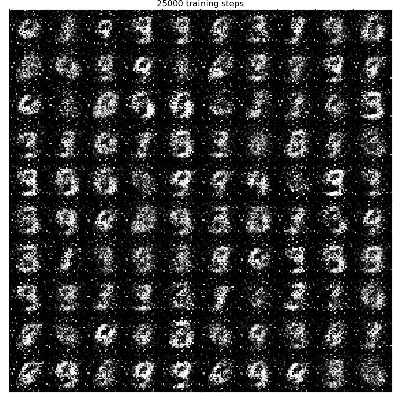
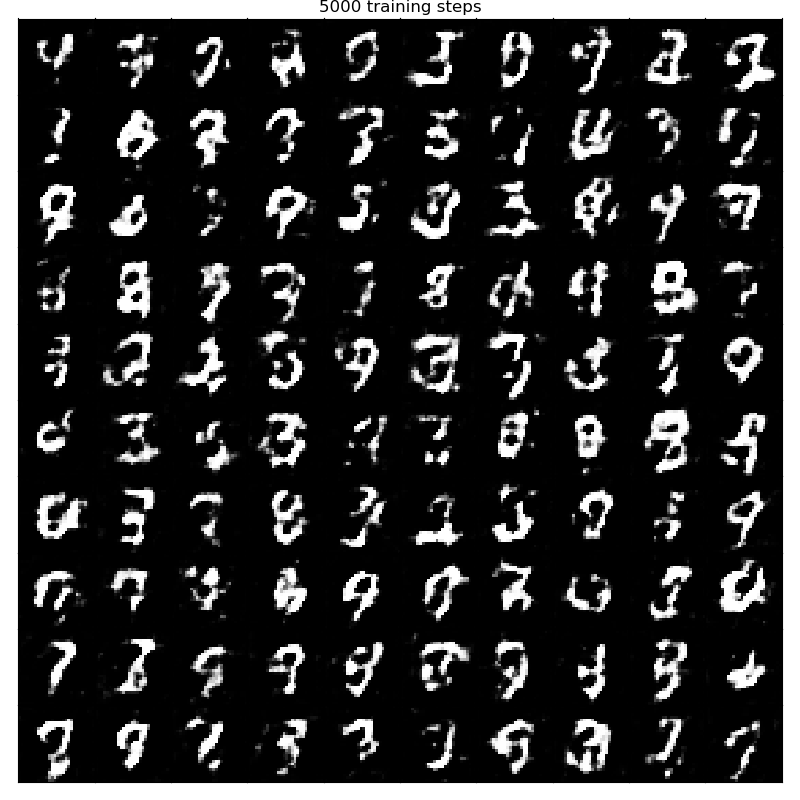
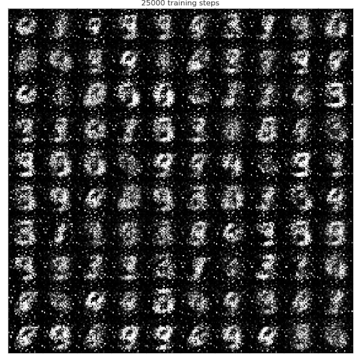
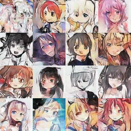
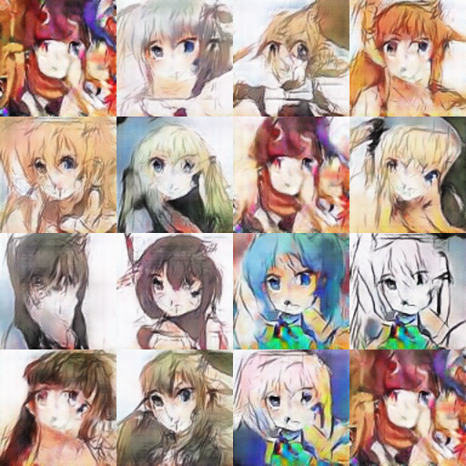
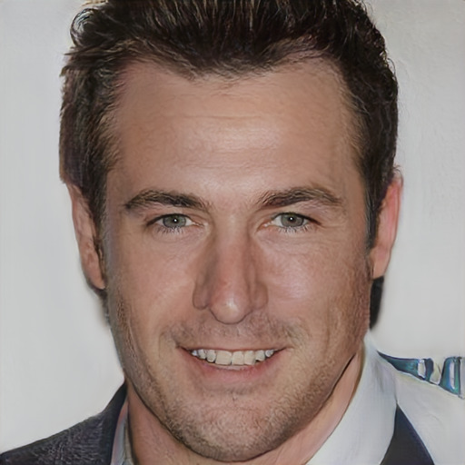

[Generative Adverserial Networks](https://en.wikipedia.org/wiki/Generative_adversarial_network)
(GAN) were introduced in 2014 by Goodfellow et al<sup>[1](#bib1)</sup>. 
These networks are generative models: after training a GAN on a dataset the goal
is to produce content very similar to what the original dataset holds.
A GAN is composed of two nets, a *Generator* and a *Discriminator*, that compete
against each other in a zero-sum game.

When considering an image dataset:

* The goal of the Generator is to produce an image that is difficult to
  distinguish from real dataset images. The Generator has access to vector of
  random noise called *latent space*. The Generator's output is called
  a *fake* image.
* The Discriminator takes as input an image, either fake or real, and has to
  output the probability with which it thinks the image is real.

During training the Discriminator gets better at recognizing fake images from
real which makes the task of the Generator more difficult so the Generator gets
better at producing realistic images. This in turns makes the task of the
Discriminator more difficult and so on.

# GANs applied to the MNIST dataset

In [mnist_gan.ml](https://github.com/LaurentMazare/ocaml-torch/tree/master/examples/gan/mnist_gan.ml)
we use some simple GAN architecture to generate images similar to the MNIST dataset of hand written
digits.

Both the Generator and the Discriminator use a single hidden layer of 128 nodes.
The latent space has size 100. Leaky ReLU are used as an activation to make training more stable.
The output of the Generator goes through a tanh activation function so that it is normalized
between -1 and 1. Real MNIST images are also normalized between -1 and 1.

Note that the `create_generator` function takes as input `vs`, a variable store. Variables
for the linear layers will be added to this store. It returns a function that applies
the linear layers to some input.
The `create_discriminator` function also takes as input a variable store
and returns a function applying the linear layers to some (fake or real) input.

```ocaml
let create_generator vs =
  let linear1 = Layer.Linear.create vs ~input_dim:latent_dim generator_hidden_nodes in
  let linear2 = Layer.Linear.create vs ~input_dim:generator_hidden_nodes image_dim in
  fun rand_input ->
    Layer.Linear.apply linear1 rand_input ~activation:Leaky_relu
    |> Layer.Linear.apply linear2 ~activation:Tanh

let create_discriminator vs =
  let linear1 = Layer.Linear.create vs ~input_dim:image_dim discriminator_hidden_nodes in
  let linear2 = Layer.Linear.create vs ~input_dim:discriminator_hidden_nodes 1 in
  fun xs ->
    Layer.Linear.apply linear1 xs ~activation:Leaky_relu
    |> Layer.Linear.apply linear2 ~activation:Sigmoid
```

During each training step the Discriminator and Generator are trained independently.
Two optimizers are created, one of them applies to Discriminator variables, the
other to Generator variables.

```ocaml
let opt_g = Optimizer.adam generator_vs ~learning_rate in
let opt_d = Optimizer.adam discriminator_vs ~learning_rate in
```

The training loop then runs these two optimizers consecutively.
When optimizing the Discriminator both real and fake images are used. When
optimizing the Generator only fake images are used.
Each time some new random values are generated for the latent space.
The Discriminator loss uses binary cross-entropy. Some smoothing is applied to the real label.
The Generator loss is based on the probability for the Discriminator to output 1 on
fake inputs.

```ocaml
for batch_idx = 1 to batches do
  let batch_images, _ = Mnist_helper.train_batch mnist ~batch_size ~batch_idx in
  (* Forward pass computing the discriminator loss. *)
  let discriminator_loss =
    Tensor.(+)
      (bce ~labels:0.9 (discriminator Tensor.(f 2. * batch_images - f 1.)))
      (bce ~labels:0.0 (rand () |> generator |> discriminator))
  in
  (* Backward pass optimizing the discriminator. *)
  Optimizer.backward_step ~loss:discriminator_loss opt_d;

  (* Forward pass computing the generator loss. *)
  let generator_loss = bce ~labels:1. (rand () |> generator |> discriminator) in
  (* Backward pass optimizing the generator. *)
  Optimizer.backward_step ~loss:generator_loss opt_g;
```

We generate some output samples using the Generator at various points during
training.  Note that we use the same random noise for these sampled values
during training as it makes it easier to see progresses.

```ocaml
  if batch_idx % 100000 = 0 || (batch_idx < 100000 && batch_idx % 25000 = 0)
  then
    write_samples (generator fixed_noise) ~filename:(sprintf "out%d.txt" batch_idx)
```



# Deep Convolutional GANs

Deep convolutional GANs (DCGAN) were introduced in 2015<sup>[3](#bib3)</sup>.

The main difference with our first version is that the Generator and
discriminator now use 2D convolutions.

```ocaml
let create_generator vs =
  let convt1 = Layer.ConvTranspose2D.create_ vs ~ksize:7 ~stride:1 ~padding:0 ~input_dim:100 64 in
  let convt2 = Layer.ConvTranspose2D.create_ vs ~ksize:4 ~stride:2 ~padding:1 ~input_dim:64 32 in
  let convt3 = Layer.ConvTranspose2D.create_ vs ~ksize:4 ~stride:2 ~padding:1 ~input_dim:32 1 in
  fun rand_input ->
    Layer.ConvTranspose2D.apply convt1 rand_input
    |> Tensor.const_batch_norm
    |> Tensor.relu
    |> Layer.ConvTranspose2D.apply convt2
    |> Tensor.const_batch_norm
    |> Tensor.relu
    |> Layer.ConvTranspose2D.apply convt3 ~activation:Tanh

let create_discriminator vs =
  let conv1 = Layer.Conv2D.create_ vs ~ksize:4 ~stride:2 ~padding:1 ~input_dim:1 32 in
  let conv2 = Layer.Conv2D.create_ vs ~ksize:4 ~stride:2 ~padding:1 ~input_dim:32 64 in
  let conv3 = Layer.Conv2D.create_ vs ~ksize:7 ~stride:1 ~padding:0 ~input_dim:64 1 in
  fun xs ->
    Layer.Conv2D.apply conv1 xs
    |> Tensor.leaky_relu
    |> Layer.Conv2D.apply conv2
    |> Tensor.const_batch_norm
    |> Tensor.leaky_relu
    |> Layer.Conv2D.apply conv3 ~activation:Sigmoid
```

The rest of the training code is mostly unchanged and can be found in
[mnist_dcgan.ml](https://github.com/LaurentMazare/ocaml-torch/tree/master/examples/gan/mnist_dcgan.ml).
Here are some sample outputs:



# Conditional GANs

The Conditional GAN (cGAN) architecture is a simple variant of the original
GAN, cGANs were presented by Mirza and Osindero in 2014<sup>[2](#bib2)</sup>.
In this setting both the Generator and Discriminator take as additional input
some annotations for which ground truth is available in the original dataset.
In the MNIST case this annotation is the digit class encoded as a one-hot
vector. For real images the actual label is used, for fake images both the
Discriminator and the Generator receive the same label. The Generator now has
to learn to produce realistic outputs conditional on a given label.

The same architecture is used as in the previous example.
[mnist_cgan.ml](https://github.com/LaurentMazare/ocaml-torch/tree/master/examples/gan/mnist_cgan.ml)
uses cGANs to generate MNIST digits.

The gif below illustrates the progress made by the Generator in the training
process. Note that it is now easy to ask the Generator to produce images for
a given class.



# Relativistic GANs
Relativistic GANs provide some variations of the GAN loss function<sup>[4](#bib4)</sup>. 
Here are some samples in 64x64 and 128x128 on the anime faces dataset.





# Progressive Growing of GANs (inference only)

The `progressive_growing_gan.ml` file contains an ocaml-torch implementation
of the generator used in the [progressive growing of GANs github repo](https://github.com/tkarras/progressive_growing_of_gans).

Pre-trained weights can be found here: [prog-gan.ot](https://github.com/LaurentMazare/ocaml-torch/releases/download/v0.1-unstable/prog-gan.ot).
These have been trained on the CelebA-HQ dataset. Using these
the following command generate samples of size 1024x1024 as illustrated below.

```bash
dune build examples/gan/progressive_growing_gan.exe
dune exec examples/gan/progressive_growing_gan.exe prog-gan.ot
```



# Bibliography
<a name="bib1">1</a>: 
Generative Adversarial Networks.
Ian J. Goodfellow, Jean Pouget-Abadie, Mehdi Mirza, Bing Xu, David Warde-Farley, Sherjil Ozair, Aaron Courville, Yoshua Bengio.
[arXiv:1406.2661](https://arxiv.org/abs/1406.2661) 2014.

<a name="bib2">2</a>: 
Conditional Generative Adversarial Nets.
Mehdi Mirza, Simon Osindero.
[arXiv:1411.1784](https://arxiv.org/abs/1411.1784) 2014.

<a name="bib3">3</a>: 
Unsupervised Representation Learning with Deep Convolutional Generative Adversarial Networks.
Alec Radford, Luke Metz, Soumith Chintala.
[arXiv:1511.06434](https://arxiv.org/abs/1511.06434) 2015.

<a name="bib4">4</a>: 
The relativistic discriminator: a key element missing from standard GAN.
Alexia Jolicoeur-Martineau.
[arXiv:1087.00734](https://arxiv.org/abs/1807.00734) 2018.
